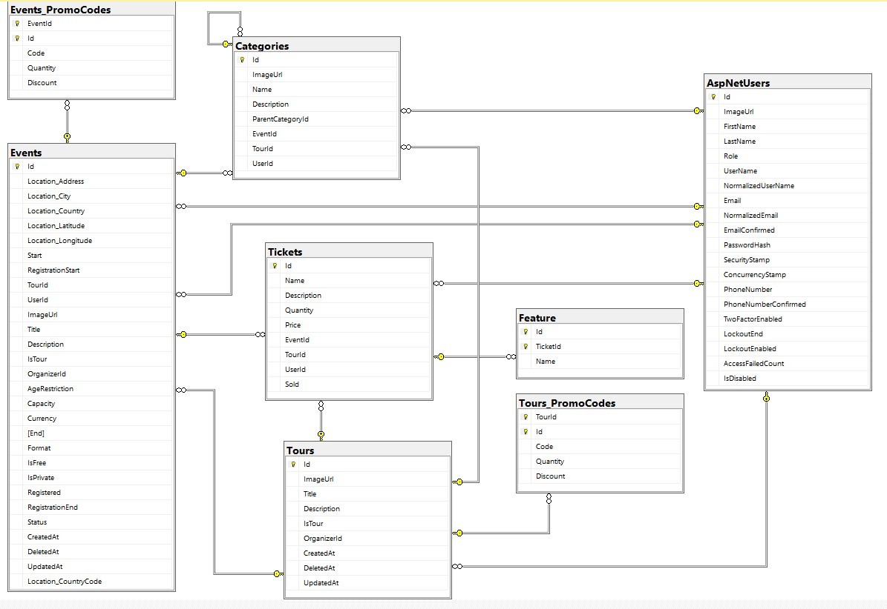

# EventHub: Your Ultimate Event Experience

### Overview:
__EventHub__ is a comprehensive web application designed to streamline the process of event ticketing, registration, and management. Whether it's a concert, conference, sports event, or a community gathering, __EventHub__ provides event organizers and attendees with a seamless and efficient platform to create, manage, and attend events.

### Features:
- Users can conveniently browse listed events (search, filter by category, price, location, age restriction)
- Organizers can create events with essential details such as event name, date, location, description, images, and ticket types.
- Notifications about users favourite categories (asked while registering)
- Purchasing tickets
- QR-code as a ticket after submission of purchase
- Analytics about event ticket sales, attendance, demographics of attendees
- Integration with social media platforms for sharing about events
- Integration with mapping providers to find the location
- Integration with calendars to set reminders

---
#### Normalized Database Diagram:
